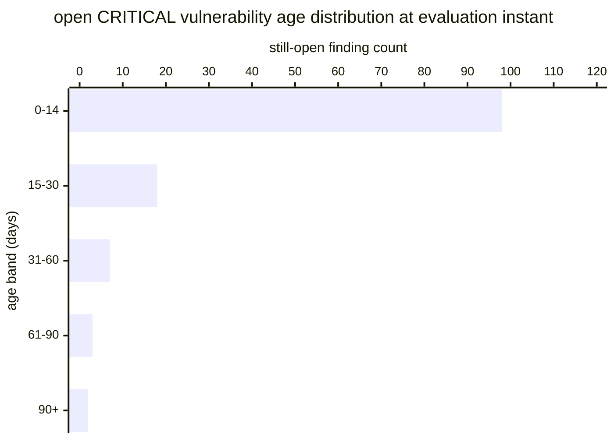

# Reference visualisation — `kri.vuln_critical_open_age_p99@v1`

This is the committed reference-visualisation artifact for the
open-critical vulnerability P99 age KRI. It exists so the G-04
catalog definition-of-done (a *committed* reference visualisation,
not a narrated one) is closed; downstream compile targets (n8n /
Temporal / LangGraph) read the same metric YAML and render the
executable form in their own dashboard surface. The artifact here is
the contract for the chart shape, not the executable chart.

Companion note: this KRI is the *long-tail* cut of the same
still-open-critical population that
`kri.unpatched_critical_cve_age_days@v1` reports at the P95.
Reviewers reading these two together get both the shoulder (P95) and
the extreme tail (P99) of the ageing distribution — the P95 is the
"typical open critical" reading; the P99 is the "worst-still-open"
reading that no SLA-compliance ratio surfaces.

## Chart kind

Two-panel composition. The headline panel is a percentile-stack of
three numbers — P50, P95, P99 — read over the still-open
CRITICAL-severity finding population at the evaluation instant, with
the P99 highlighted as the primary figure. The drill-down panel is
an age-histogram bar chart binning the still-open population by
day-band (0–14, 15–30, 31–60, 61–90, 90+), plotting per-band finding
count so operators can see how the far tail of the ageing
distribution is shaped. Because the KRI is `lower_is_better`, a
rising value is the unhealthy signal that residual critical exposure
has drifted past the operator's SLA window.

- **Headline (days):** `P99(age_days)` across the still-open critical
  population; the figure operators read first, with `P50` and `P95`
  shown alongside for context.
- **Drill-down x-axis:** age day-band (0–14, 15–30, 31–60, 61–90,
  90+).
- **Drill-down y-axis:** count of still-open CRITICAL findings in
  the band.
- **Threshold overlay:** horizontal lines on the P99 headline number
  at the `warn` (14 days), `high` (30 days) and `breach` (60 days)
  bounds — because the KRI is `lower_is_better`, all three bounds
  sit *above* target and a value above any line lands inside the
  corresponding band.
- **Headline annotation:** the P99 value with the threshold band it
  falls in, plus the population size `|U|` (small-population marker
  when `|U| < 100` so downstream consumers do not read the P99 as if
  it were the tail of a large population).

## Reference rendering (Mermaid)

The mermaid block below is the canonical reference rendering — small
enough to live in-tree and renderable directly on the public repo
surface. The numeric values are illustrative; the compile target is
the source of truth for the executable form against operator data.

Reading the bars in this illustrative rendering (assume `|U| = 128`
still-open CRITICAL findings and the P99 falls in the 61–90 day
band):

| age band | count | cumulative | reading                          |
|----------|-------|------------|----------------------------------|
| 0–14     | 98    | 98         | inside warn bound                |
| 15–30    | 18    | 116        | past warn bound                  |
| 31–60    | 7     | 123        | past high bound                  |
| 61–90    | 3     | 126        | past breach bound (P99 lands here) |
| 90+      | 2     | 128        | far past breach bound            |

The headline `P99(age_days)` here is ~72 days — above the `breach`
bound (60), so the KRI reads inside the breach band for this
snapshot; a drift downward under 60 would drop the reading into the
high band, under 30 into the warn band, under 14 into a healthy
reading at target. For comparison, the P95 companion indicator
(shoulder rather than tail) reads ~20 days on the same population —
inside the high band on its own thresholds.

## Threshold band reference

| name      | comparator | value (days) | severity  |
|-----------|------------|--------------|-----------|
| warn      | >          | 14           | warn      |
| high      | >          | 30           | high      |
| breach    | >          | 60           | critical  |

The bands match the `thresholds` array on
`vuln_critical_open_age_p99.yaml`; the catalog entry is the source
of truth, this file is the visualisation surface.

## OCSF source-data shape

The chart's underlying observations are derived from the OCSF
`Vulnerability Finding` events (`class_uid: 2002`) the operator's
vulnerability-management surface emits at triage. The still-open
predicate is the absence of a paired closure evidence record from
the verify-remediation step on the same finding stable_id, evaluated
at the evaluation instant. The catalog entry binds to the OCSF class
shape, not to a vendor-specific scanner or ticket object. The
binding lives at
`content/telemetry/telemetry.ocsf.vulnerability_finding@v1.json` and
is back-referenced from the metric YAML's `telemetry_refs[]` and
from the `triage_timestamp` / `remediation_close`
`measurement.inputs[].telemetry_ref`.

## Operator override

Operators are expected to render this indicator in their own
dashboard idiom — the catalog reference rendering above is the
contract for the chart shape (P99-headline number alongside P50 /
P95, with `warn` / `high` / `breach` bounds and a still-open
population age-histogram drill-down), not the visual style. The
compile target is the source of truth for the executable form.
