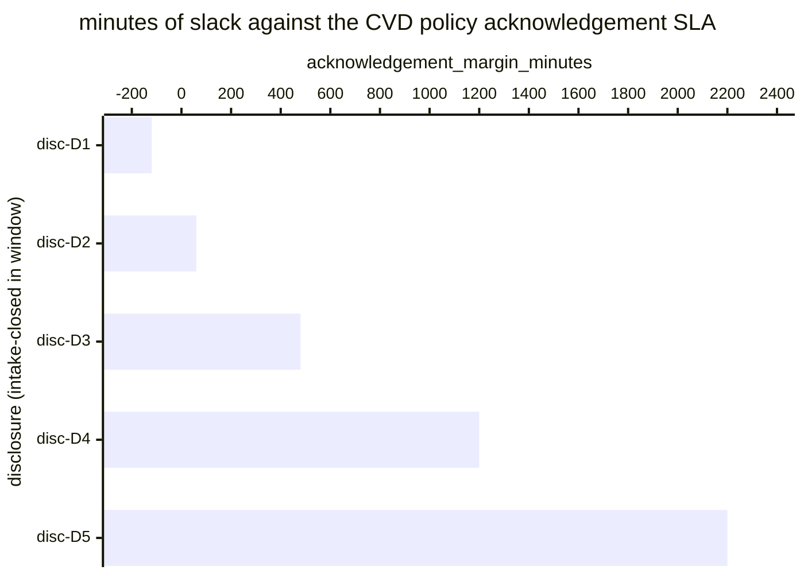

# Reference visualisation — `kpi.vuln_disclosure_sla@v1`

This is the committed reference-visualisation artifact for the
coordinated-vulnerability-disclosure (CVD) intake SLA compliance
KPI. It exists so the G-04 catalog definition-of-done (a *committed*
reference visualisation, not a narrated one) is closed; downstream
compile targets (n8n / Temporal / LangGraph) read the same metric
YAML and render the executable form in their own dashboard surface.
The artifact here is the contract for the chart shape, not the
executable chart.

## Chart kind

Two-panel composition. The headline panel is a single gauge-style
horizontal bar reading the on-time-acknowledgement rate (`ratio`)
against the catalog `warn` and `breach` thresholds. The drill-down
panel is a horizontal bar chart, one bar per inbound disclosure
whose intake-step transition closed within the evaluation window,
plotting `acknowledgement_margin_minutes` — minutes between the
reporter-acknowledgement timestamp and the operator's documented CVD
policy SLA deadline. Positive bars are on-time slack; negative bars
are SLA misses and contribute the failing samples that pull the
ratio below 1.00.

- **Headline (ratio):** the `ratio` aggregate across inbound
  disclosures intake-closed in the window, rendered against the
  `warn` (< 0.95) and `breach` (< 0.80) bands from the catalog
  entry. This is the figure the operator's CVD-channel surface reads
  first.
- **Drill-down x-axis:** `acknowledgement_margin_minutes` — minutes
  remaining at acknowledgement against the CVD policy SLA. Positive
  values left-to-right are on-time slack; negative values left of
  zero are SLA misses.
- **Drill-down y-axis:** one row per inbound disclosure
  intake-closed in the window, labelled by the case `disclosure.uid`;
  sorted ascending so the slimmest margins (and any misses) sit at
  the top — the disclosures that are about to break the rate.
- **Threshold overlay (drill-down):** a vertical line at zero —
  every bar left of zero is a sample that failed the SLA and
  contributes a `1` to the denominator without contributing a `1` to
  the numerator. Operators reading the drill-down see *which*
  disclosures pulled the ratio off 1.00.

## Reference rendering (Mermaid)

The mermaid block below is the canonical reference rendering — small
enough to live in-tree and renderable directly on the public repo
surface. The numeric values are illustrative; the compile target is
the source of truth for the executable form against operator data.

Reading the bars in this illustrative rendering:

| disclosure | acknowledgement_margin_minutes | on-time? | reading                                                |
|------------|--------------------------------|----------|--------------------------------------------------------|
| disc-D1    | -120                           | no       | CVD policy SLA missed by 120 min                       |
| disc-D2    | 60                             | yes      | dispatched 60 min before deadline — thin slack         |
| disc-D3    | 480                            | yes      | comfortable slack on reporter acknowledgement          |
| disc-D4    | 1200                           | yes      | mid-window acknowledgement, healthy slack              |
| disc-D5    | 2200                           | yes      | early acknowledgement, large slack                     |

With one miss across five disclosures, the headline `ratio` resolves
to `4 / 5 = 0.80` — sitting right on the `breach` floor (< 0.80).
That value is what the catalog aggregation
`measurement.aggregation: ratio` resolves to for this snapshot.

## Threshold band reference

| name      | comparator | value  | severity  |
|-----------|------------|--------|-----------|
| warn      | <          | 0.95   | warn      |
| breach    | <          | 0.80   | high      |

The bands match the `thresholds` array on
`vuln_disclosure_sla.yaml`; the catalog entry is the source of
truth, this file is the visualisation surface. The catalog `target`
(`>= 0.95`) is the floor the warn band sits on, and the operator's
CVD policy is the source of truth for the per-disclosure SLA
threshold used to compute the per-disclosure on-time predicate.

## OCSF source-data shape

The chart's underlying observations are derived from the operator's
CVD intake pipeline. Each inbound disclosure whose intake-step
transition closed within the evaluation window contributes one
`acknowledgement_margin_minutes` sample computed against the inputs
declared in `vuln_disclosure_sla.yaml`'s `measurement.inputs`:

- `intake_disclosure` — first playbook step transition that
  registers an inbound disclosure on the case ledger, bound to
  `action--01a17a01-0000-4000-8000-000000000002` on
  `playbook.vuln_intake@v1` per the catalog entry's `playbook_refs`.
  This step records the `disclosure_received_timestamp` that anchors
  the per-disclosure SLA clock.
- `reporter_acknowledgement` — acknowledgement send-event recorded
  against the disclosure on the case ledger. The compile target
  binds the concrete delivery channel (email-to-reporter, web-form
  acknowledgement, signed bug-bounty handoff, etc.). The
  acknowledgement-send timestamp is the second input to the on-time
  predicate.

The on-time predicate for the ratio is
`(reporter_acknowledgement - intake_disclosure) <= operator_cvd_sla`,
where `operator_cvd_sla` is the per-disclosure SLA declared by the
operator's CVD policy (CRA Annex I §2(5) single-point-of-contact
obligation). Excluded from the denominator: disclosures whose intake
step never fired — so the indicator does not silently improve when
the disclosure-intake channel stalls outright.

The catalog entry deliberately does not pin a single OCSF telemetry
binding at the unscoped baseline: the inbound CVD disclosure arrives
over an operator-specific channel (CVD web form, security@-style
mailbox, bug-bounty handoff), and there is no unambiguous OCSF event
class that covers the intersection of those channels at the catalog
level. The deferral is named honestly — the playbook step transition
is the binding for the intake event, not an OCSF class. A CORE
follow-up may add an OCSF binding once the operator's CVD intake
channel is declared.

The reference rendering above remains shape-valid: it reads two
timestamps per disclosure (the intake-closed timestamp and the
reporter-acknowledgement timestamp) and computes a duration,
regardless of which channel the operator's compile target resolves
the disclosure intake against.

## Operator override

Operators are expected to render this metric in their own dashboard
idiom — the catalog reference rendering above is the contract for
the chart shape (ratio headline, per-disclosure acknowledgement-margin
drill-down, zero-line on-time overlay), not the visual style. The
compile target is the source of truth for the executable form.
