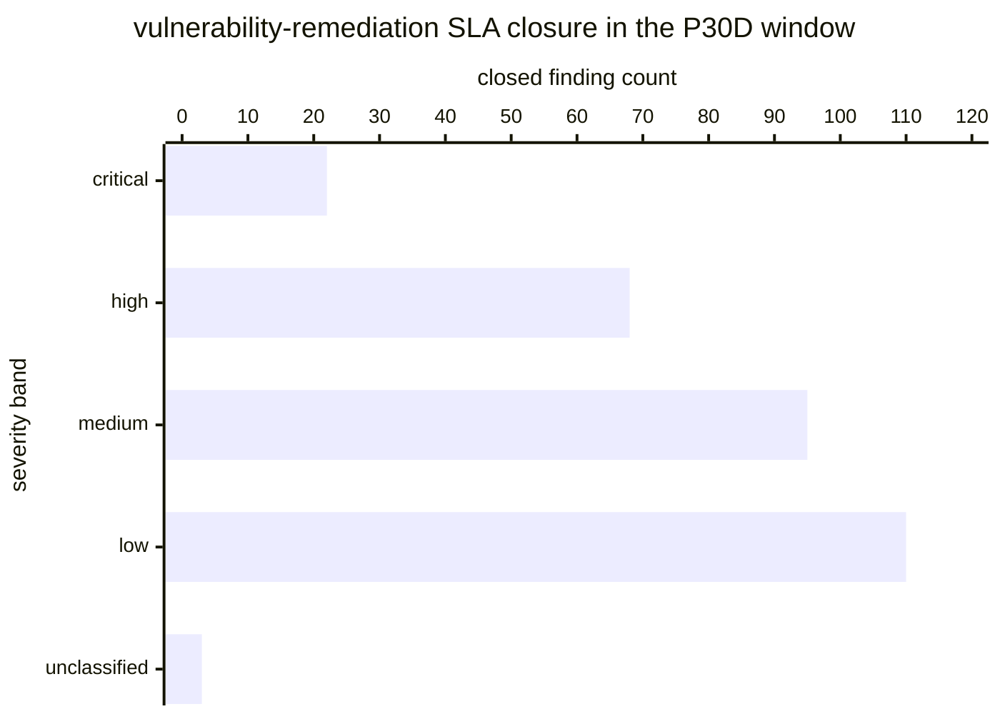

# Reference visualisation — `kpi.vuln_remediation_sla_compliance@v1`

This is the committed reference-visualisation artifact for the
vulnerability-remediation SLA compliance KPI. It exists so the G-04
catalog definition-of-done (a *committed* reference visualisation,
not a narrated one) is closed; downstream compile targets (n8n /
Temporal / LangGraph) read the same metric YAML and render the
executable form in their own dashboard surface. The artifact here is
the contract for the chart shape, not the executable chart.

## Chart kind

Two-panel composition. The headline panel is a single ratio-headline
gauge reading the SLA-compliance ratio `|W| / |C|` — the share of CVE
findings closed within the per-severity SLA window over the total
closed-finding population in the evaluation window. The drill-down
panel is a stacked bar chart, one bar per severity band (critical,
high, medium, low, unclassified), plotting SLA-met versus overdue
counts so operators can see which severity band pulled the aggregate
ratio away from target. Because the KPI is `higher_is_better`, a
rising value is the healthy signal that the vulnerability-handling
lane is closing findings inside the operator's cadence policy.

- **Headline (ratio):** `|W| / |C|` across in-scope closed findings
  in the window; the figure operators read first.
- **Drill-down x-axis:** severity band (critical, high, medium, low,
  unclassified).
- **Drill-down y-axis:** finding count, stacked (SLA-met on the
  bottom, overdue on the top).
- **Threshold overlay:** horizontal lines on the headline gauge at
  the `warn` (0.90), `high` (0.75) and `breach` (0.50) ratio bounds
  — because the KPI is `higher_is_better`, all three bounds sit
  *below* the target and a value below any line lands inside the
  corresponding band.
- **Headline annotation:** the overall `|W| / |C|` ratio with the
  threshold band it falls in.

## Reference rendering (Mermaid)

The mermaid block below is the canonical reference rendering — small
enough to live in-tree and renderable directly on the public repo
surface. The numeric values are illustrative; the compile target is
the source of truth for the executable form against operator data.

Reading the bars in this illustrative rendering (assume the SLA-met
counts sit at critical=20, high=61, medium=88, low=104, unclassified=2
against the totals above, giving `|W|=275` and `|C|=298`):

| severity band  | closed | SLA-met | overdue | per-band ratio | reading                       |
|----------------|--------|---------|---------|----------------|-------------------------------|
| critical       | 22     | 20      | 2       | 0.909          | just above warn bound         |
| high           | 68     | 61      | 7       | 0.897          | just below warn bound         |
| medium         | 95     | 88      | 7       | 0.926          | above warn bound              |
| low            | 110    | 104     | 6       | 0.945          | above warn bound              |
| unclassified   | 3      | 2       | 1       | 0.667          | below high bound (documented) |

The headline `|W| / |C|` figure here is `275/298 = 0.923` — above the
`warn` bound (0.90) so the KPI reads healthy for this snapshot; a
drift downward toward 0.90 would drop the reading into the warn band
and a drift below 0.75 into the high band.

## Threshold band reference

| name      | comparator | value (ratio) | severity  |
|-----------|------------|---------------|-----------|
| warn      | <          | 0.90          | warn      |
| high      | <          | 0.75          | high      |
| breach    | <          | 0.50          | critical  |

The bands match the `thresholds` array on
`vuln_remediation_sla_compliance.yaml`; the catalog entry is the
source of truth, this file is the visualisation surface.

## OCSF source-data shape

The chart's underlying observations are derived from the OCSF
`Vulnerability Finding` events (`class_uid: 2002`) the operator's
vulnerability-management surface emits at each triage and each
verify-remediation step. The severity-band classification is carried
on the finding's `severity_id` / operator-mapped severity taxonomy
per the vulnerability_management playbook's triage-severity step —
the catalog entry binds to the OCSF class shape, not to a
vendor-specific scanner or ticket object. The binding lives at
`content/telemetry/telemetry.ocsf.vulnerability_finding@v1.json` and
is back-referenced from the metric YAML's `telemetry_refs[]` and from
the `triage_timestamp` / `remediation_close`
`measurement.inputs[].telemetry_ref`.

## Operator override

Operators are expected to render this metric in their own dashboard
idiom — the catalog reference rendering above is the contract for
the chart shape (SLA-compliance headline gauge with `warn` / `high` /
`breach` bounds, per-severity-band stacked bar drill-down), not the
visual style. The compile target is the source of truth for the
executable form.
