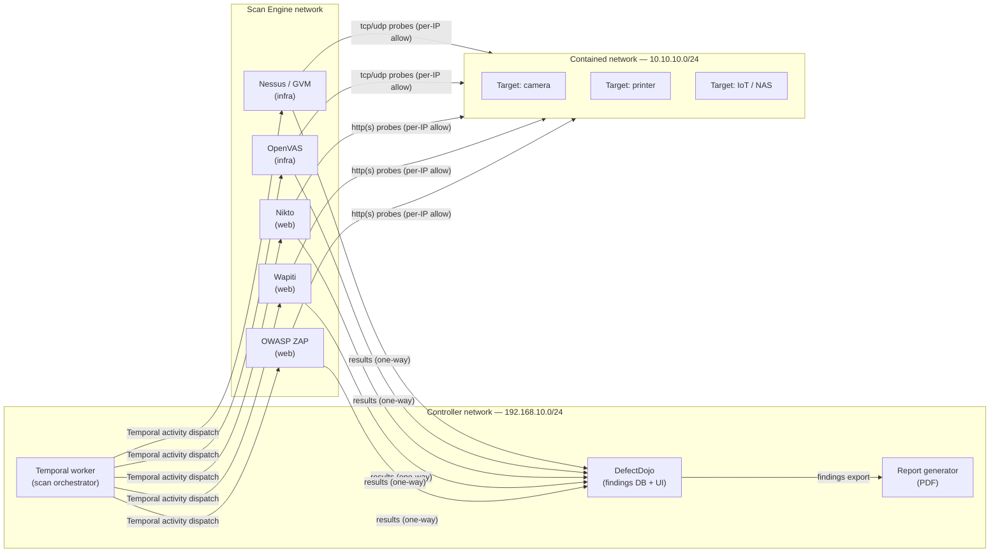
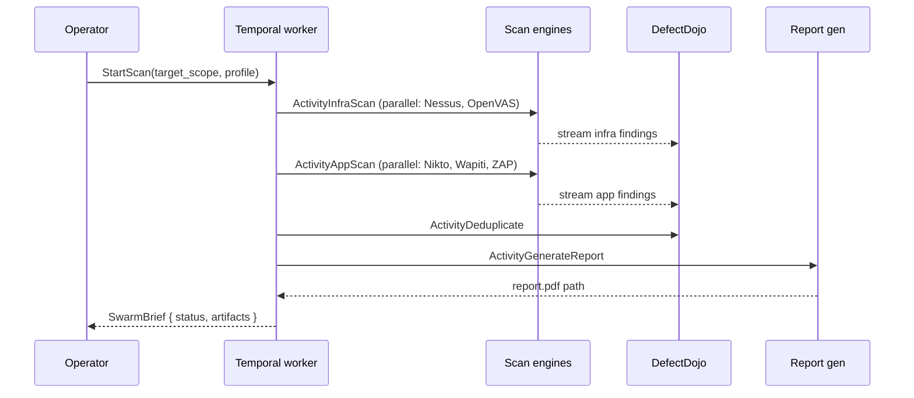

# SecOps-NG Vulnscan — Architecture

Status: draft (community review)
Scope: dynamic vulnerability scanning workflow for small-office and
home-office network estates (cameras, printers, IoT, network devices,
web endpoints).

---

## 1. Design goals

- Containment-first: the act of scanning must not expand the attack
  surface of the network being scanned, nor of the network performing
  the scan.
- Durable execution: every scan is a Temporal workflow. Failures,
  interruptions, and partial results are restartable without re-running
  finished work.
- Sovereign by default: engines, orchestrator, dashboard, and report
  generator all run on operator-controlled infrastructure (Nebul or
  any EU-hosted Docker host).
- Multi-engine: no single scanner is trusted as authoritative.
  Findings are aggregated and de-duplicated downstream.

---

## 2. Network topology

Three logically distinct networks, all isolated from the public
internet for the duration of a scan run. Inspired by published
multi-engine scan-network designs; rendered here in SecOps-NG identity.

| Network         | CIDR             | Reachable from         | Reachable to            |
|-----------------|------------------|------------------------|-------------------------|
| Controller      | 192.168.10.0/24  | Operator (jump host)   | Scan Engine (dispatch)  |
| Scan Engine     | (operator chosen)| Controller only        | Contained (per-IP allow)|
| Contained       | 10.10.10.0/24    | Scan Engine (per-IP)   | (no egress)             |

Neither the Scan Engine network nor the Contained network has a route
to the public internet during a scan run. The Controller has outbound
access only as required to pull engine images and feed updates,
performed before the scan window, not during it.

---

## 3. Component responsibilities

### 3.1 Controller

- Hosts the Temporal worker that owns the scan workflow.
- Builds scan-engine container images from pinned base images and
  pinned feed snapshots. Engines are built here and deployed outward;
  engines never build themselves at runtime.
- Hosts DefectDojo as the durable findings store.
- Hosts the report generator that renders the PDF deliverable.

### 3.2 Scan Engine network

Five engines, two layers:

- Infrastructure layer: Nessus (or Greenbone GVM) and OpenVAS — TCP/UDP
  service discovery, CVE matching, configuration audit.
- Application layer: Nikto, Wapiti, and OWASP ZAP — HTTP(S) probing,
  injection-point discovery, header and TLS hygiene.

Engines are stateless from the operator's perspective: results are
streamed to DefectDojo, then the engine container is destroyed at end
of scan.

### 3.3 Contained network

Targets receive addresses in 10.10.10.0/24, typically via static lease
or a constrained DHCP scope on a dedicated VLAN. Egress is denied;
ingress is allowed only from explicitly enumerated Scan Engine source
IPs, on the ports the engines need.

---

## 4. Workflow shape (Temporal)

Two stages: infrastructure scan completes before application scan
begins. This ordering exists because the infra stage discovers the
HTTP(S) endpoints that the application stage then targets.

Each activity is idempotent, has a heartbeat, and is retried by
Temporal on transient failure. A crashed engine container does not
fail the workflow; it is restarted with the same activity inputs.

---

## 5. Identity and provenance

Reports are stamped with the SecOps-NG identity and the operator's
configured organisation block. The workflow records:

- Engine versions and feed timestamps at scan start.
- Target scope (CIDR or explicit IP list) and profile (timing,
  intrusiveness).
- Workflow ID and run ID, so any finding traces back to a durable,
  restartable execution record.

---

## 6. See also

- `RUNBOOK.md` — operator steps to run a scan.
- `THREAT-MODEL.md` — STRIDE on the scan-engine network.
- `DEPLOYMENT.md` — Nebul deployment notes for a small-office estate.
